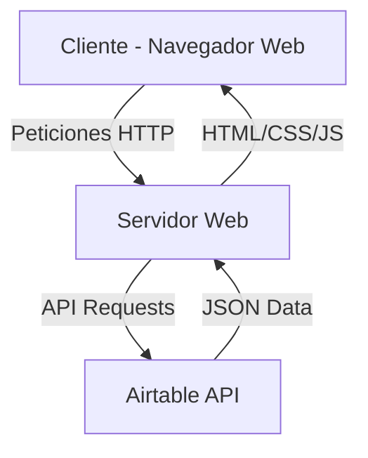
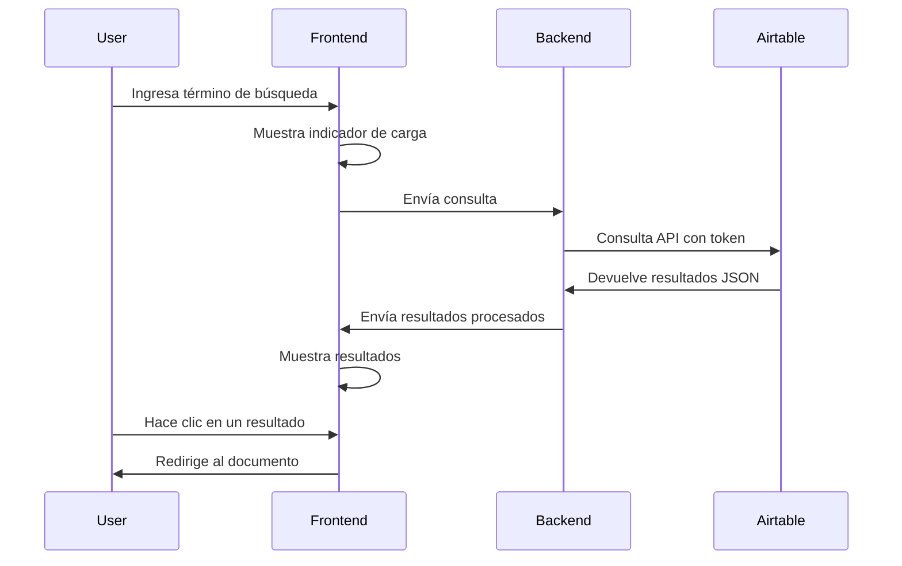

# Diseño: Aplicación de Búsqueda para Biblioteca Digital con Airtable

## Overview

La aplicación de búsqueda para la biblioteca digital será una aplicación web que permitirá a los usuarios buscar contenido mediante palabras clave en un campo único. La aplicación se integrará con Airtable como backend para obtener y mostrar los datos de la biblioteca digital. La interfaz será intuitiva y responsive, permitiendo a los usuarios buscar contenido desde cualquier dispositivo.

## Arquitectura

La aplicación seguirá una arquitectura cliente-servidor simple:



### Componentes principales:

1. **Frontend**: Interfaz de usuario desarrollada con HTML, CSS y JavaScript
2. **Backend**: Servidor que maneja las peticiones del cliente y se comunica con la API de Airtable
3. **API de Airtable**: Fuente de datos externa que proporciona la información de la biblioteca digital

## Componentes e Interfaces

### 1. Componente de Búsqueda

**Responsabilidades:**
- Mostrar el campo de búsqueda
- Capturar la entrada del usuario
- Enviar la consulta al backend
- Mostrar indicador de carga durante la búsqueda

**Interfaz:**
```typescript
interface SearchComponent {
  searchTerm: string;
  isLoading: boolean;
  search(term: string): Promise<SearchResult[]>;
  clearSearch(): void;
}
```

### 2. Componente de Resultados

**Responsabilidades:**
- Mostrar los resultados de la búsqueda
- Mostrar las imágenes en miniatura
- Proporcionar enlaces a los documentos
- Mostrar mensaje cuando no hay resultados

**Interfaz:**
```typescript
interface ResultsComponent {
  results: SearchResult[];
  hasResults: boolean;
  displayResults(results: SearchResult[]): void;
  displayNoResultsMessage(): void;
  handleResultClick(result: SearchResult): void;
}
```

### 3. Servicio de API de Airtable

**Responsabilidades:**
- Conectar con la API de Airtable
- Autenticarse usando el token proporcionado
- Realizar consultas a la base de datos
- Procesar y formatear los resultados

**Interfaz:**
```typescript
interface AirtableService {
  token: string;
  baseId: string;
  connect(): Promise<boolean>;
  search(term: string, fields: string[]): Promise<SearchResult[]>;
}
```

## Modelos de Datos

### SearchResult

```typescript
interface SearchResult {
  id: string;
  name: string;
  thumbnailUrl: string;
  documentUrl: string;
  tags: string[];
  location_tag?: string;
  context_tag?: string;
  people_tag?: string;
}
```

### SearchQuery

```typescript
interface SearchQuery {
  term: string;
  fields: string[];
}
```

## Flujo de Datos

1. El usuario ingresa un término de búsqueda y presiona Enter
2. La aplicación muestra un indicador de carga
3. El frontend envía la consulta al backend
4. El backend construye una consulta para la API de Airtable
5. La API de Airtable devuelve los resultados
6. El backend procesa los resultados y los envía al frontend
7. El frontend muestra los resultados o un mensaje de "no se encontraron resultados"
8. El usuario puede hacer clic en un resultado para acceder al documento



## Manejo de Errores

1. **Error de conexión con Airtable**
   - Mostrar mensaje de error: "No se pudo conectar con la base de datos"
   - Proporcionar opción para reintentar

2. **Error en la consulta**
   - Mostrar mensaje de error: "Error al procesar la búsqueda"
   - Registrar el error en el sistema para diagnóstico

3. **Sin resultados**
   - Mostrar mensaje amigable: "No se encontraron resultados para tu búsqueda"
   - Sugerir términos alternativos o más generales

4. **Error al cargar imágenes en miniatura**
   - Mostrar imagen de placeholder
   - Continuar mostrando el resto de la información del resultado

## Estrategia de Pruebas

### Pruebas Unitarias

1. **Componente de Búsqueda**
   - Verificar que el campo de búsqueda se muestra correctamente
   - Verificar que se captura la entrada del usuario
   - Verificar que se muestra el indicador de carga

2. **Componente de Resultados**
   - Verificar que los resultados se muestran correctamente
   - Verificar que las imágenes en miniatura se cargan
   - Verificar que los enlaces funcionan correctamente
   - Verificar que se muestra el mensaje de "no se encontraron resultados"

3. **Servicio de API de Airtable**
   - Verificar que se conecta correctamente con la API
   - Verificar que se autentifica correctamente
   - Verificar que se procesan correctamente los resultados

### Pruebas de Integración

1. **Flujo completo de búsqueda**
   - Verificar que la búsqueda funciona de principio a fin
   - Verificar que los resultados se muestran correctamente
   - Verificar que los enlaces a los documentos funcionan

2. **Manejo de errores**
   - Verificar que se manejan correctamente los errores de conexión
   - Verificar que se manejan correctamente los errores de consulta

### Pruebas de Rendimiento

1. **Tiempo de respuesta**
   - Verificar que la búsqueda responde en un tiempo razonable
   - Verificar que la aplicación no se bloquea durante la búsqueda

2. **Carga de imágenes**
   - Verificar que las imágenes en miniatura se cargan rápidamente
   - Verificar que la aplicación maneja correctamente muchos resultados

## Consideraciones Técnicas

1. **Tecnologías Recomendadas**
   - Frontend: HTML5, CSS3, JavaScript (o framework como React/Vue/Next.js)
   - Backend: Node.js con Express o API Routes de Next.js
   - Integración con Airtable: Airtable JavaScript SDK

2. **Despliegue en Vercel**
   - Configurar el proyecto para despliegue continuo en Vercel
   - Utilizar variables de entorno de Vercel para almacenar el token de Airtable
   - Aprovechar las Edge Functions de Vercel para optimizar el rendimiento
   - Configurar dominios personalizados si es necesario

3. **Seguridad**
   - El token de Airtable debe almacenarse como variable de entorno en Vercel
   - No exponer el token en el frontend
   - Implementar rate limiting para prevenir abusos

4. **Rendimiento**
   - Implementar caché para resultados frecuentes
   - Optimizar las consultas a Airtable
   - Implementar lazy loading para imágenes
   - Utilizar la CDN de Vercel para servir assets estáticos

5. **Accesibilidad**
   - Asegurar que la aplicación cumple con los estándares WCAG
   - Implementar navegación por teclado
   - Proporcionar textos alternativos para imágenes